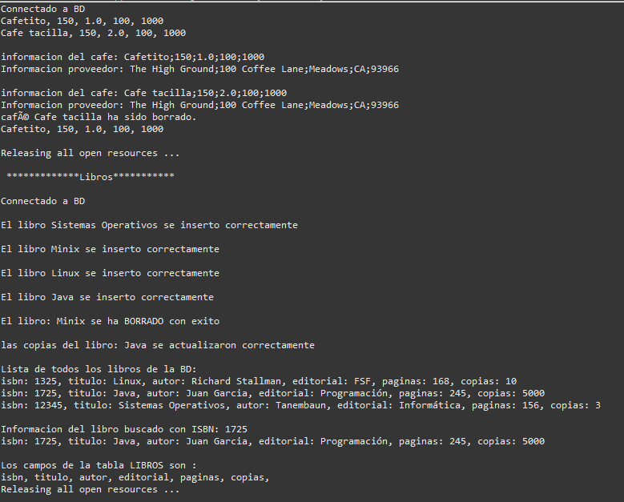

## Ejercicio 2.F

El método liberarRecursos lo llamamos al final de cada método que realiza escritura, lectura, actualización o borrado en la base de datos
en concreto en la clausula finally.
El método cerrarConexion se llama una vez se han realizado todas operaciones deseadas en la base de datos.
Es decir se abre una conexión al instanciar la clase Cafes, y se cierra llamando al método cerrarConexión cuando ya no se quiren hacer
más operaciones con la base de datos.

## Ejercicio 2.G

Esta nueva versión es menos propensa a fallos, ya que al hacer estáticos los objetos necesarios para interactuar con la base de datos,
no se tienen que definir directamente desde cada método, y es más dificil que se quede algún recurso abierto, o que empiece la ejecución 
de algun método teniendo algún valor distinto de null.

No creo que esta nueva versión presente ningún inconveniente respecto a la versión anterior, ya que el código queda algo más modularizado,
más limpio, y más corto y legible.

## Ejercicio 7

Este método nos aporta metadatos de la tabla LIBROS, es decir información sobre la tabla, y no sobre su contenido.

En este caso a partir de una consulta select conseguimos el nombre de las diferentes columnas (campos)que componen la tabla LIBROS.

## Captura de la ejecución de los diferentes métodos

Los ejercicios de la BD Cafes se han hecho con h2, y los de los Libros con SQLite

